<!-- README.md is generated from README.Rmd. Please edit that file -->

# bdxmetroidentity 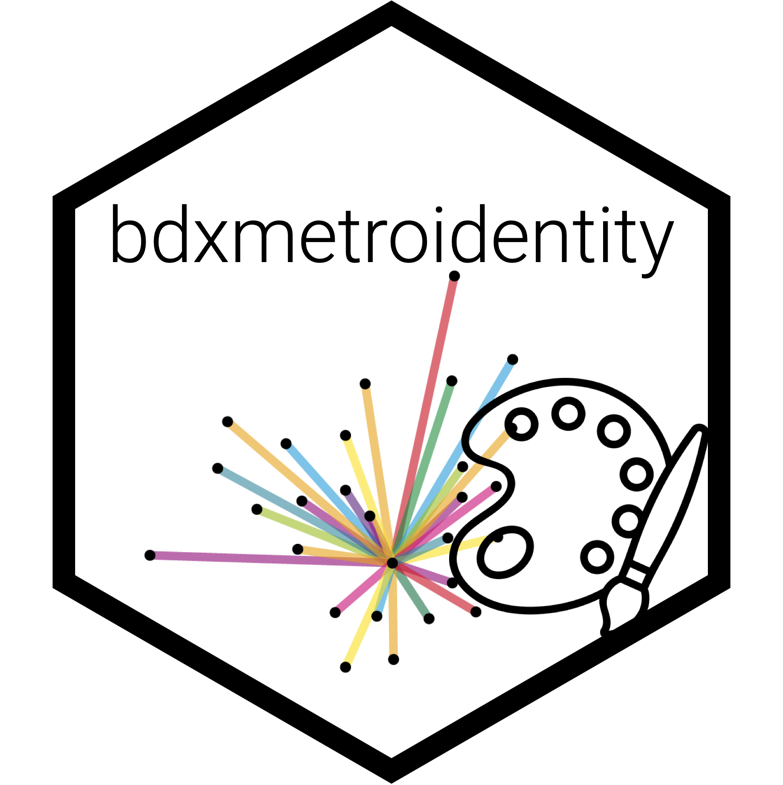

<!-- badges: start -->

<!-- badges: end -->

Le package `{bdxmetroidentity}` fournit des outils de design dédiés aux
productions data du datalab de Bordeaux Métropole. Il inclut :

  - Des fonctionnalités pour associer un thème light/dark à des
    graphiques `{ggplot2}`,
  - Des fonctionnalités pour associer un thème light/dark à des rapports
    et des vignettes R Markdown,
  - Des fonctionnalités pour associer un thème light/dark à des apps
    Shiny.

Il inclut également des fonctionnalités supplémentaires (installation de
la police de caractères Roboto, gestion de pictogrammes au format SVG,
etc.).

Le site du package est disponible ici :
<http://bdxmetropole.pages.thinkr.fr/bdxmetroidentity/>

## Installation

Pour installer le package depuis GitLab, vous pouvez lancer le script
suivant :

``` r
# install.packages("remotes")
remotes::install_git(url = "https://forge.thinkr.fr/bdxmetropole/bdxmetroidentity")
```

## Vignettes

  - *Installation du package et dépendances*
  - *Intégration de la charte graphique dans les graphiques {ggplot2}*
  - *Intégration de la charte graphique dans les rapports R Markdown*
  - *Intégration de la charte graphique dans les apps Shiny*
  - *Chargement de la font Roboto*
  - *Utilisation des pictogrammes*

Ouvrir le pkgdown
:

``` r
bdxmetroidentity::open_pkgdown()
```

## Exemples

### Graphiques `{ggplot2}`


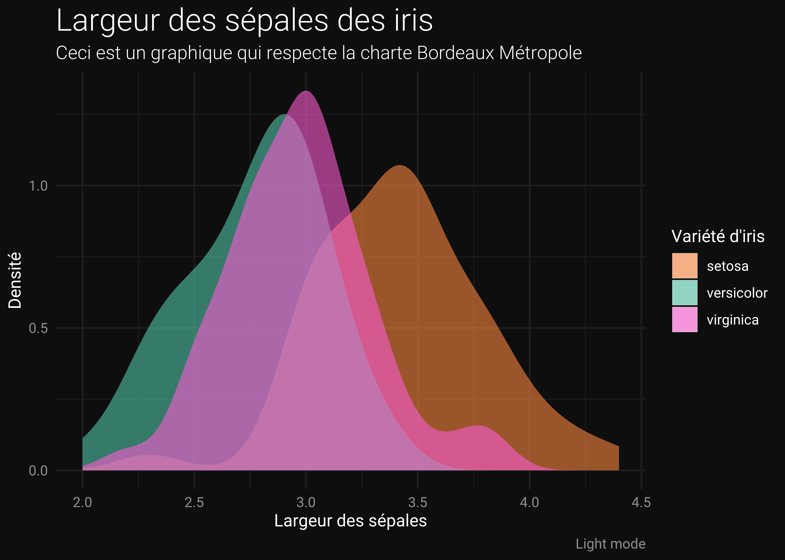

### Rapports HTML

``` r
browseURL(system.file("rmarkdown", "rmd_template_light.html", package = "bdxmetroidentity"))
```

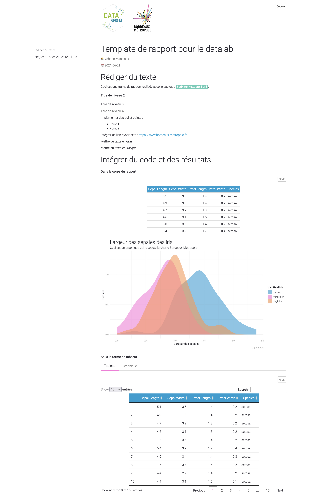

``` r
browseURL(system.file("rmarkdown", "rmd_template_dark.html", package = "bdxmetroidentity"))
```

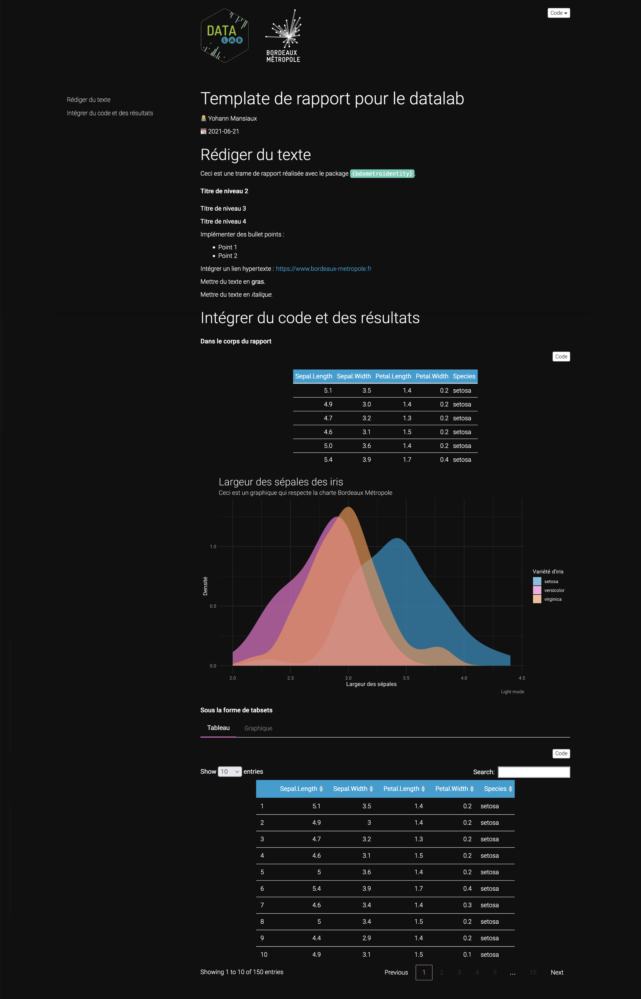

### Apps Shiny

``` r
shiny::runApp(system.file("shiny", "shiny_template_fluidpage.R", package = "bdxmetroidentity"))
```

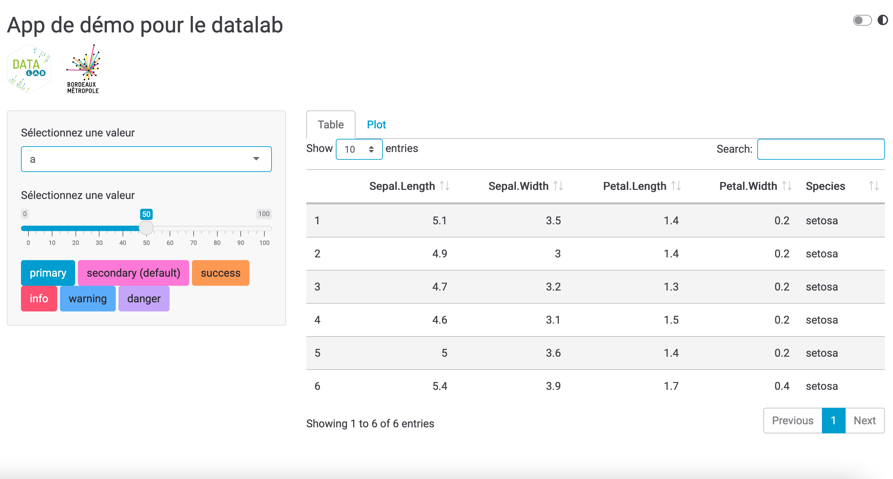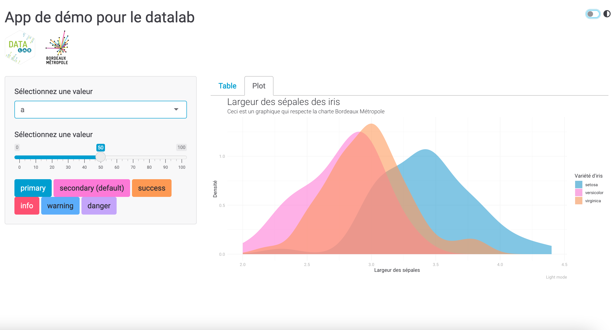

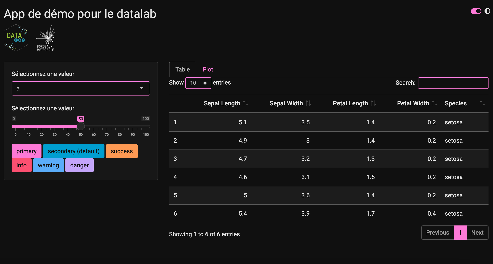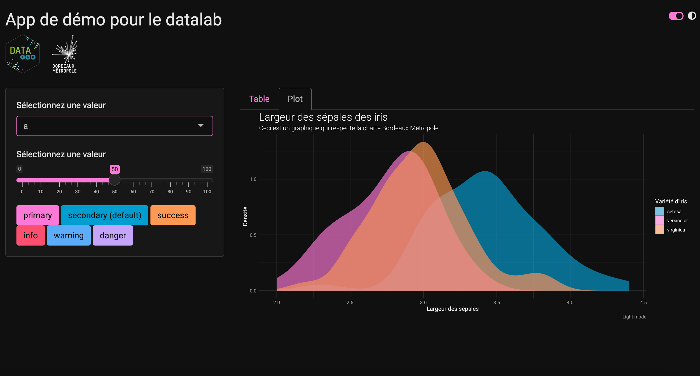

``` r
shiny::runApp(system.file("shiny", "shiny_template_navbarpage.R", package = "bdxmetroidentity"))
```

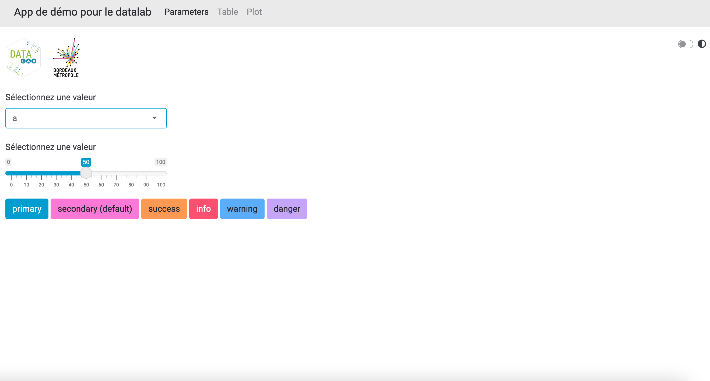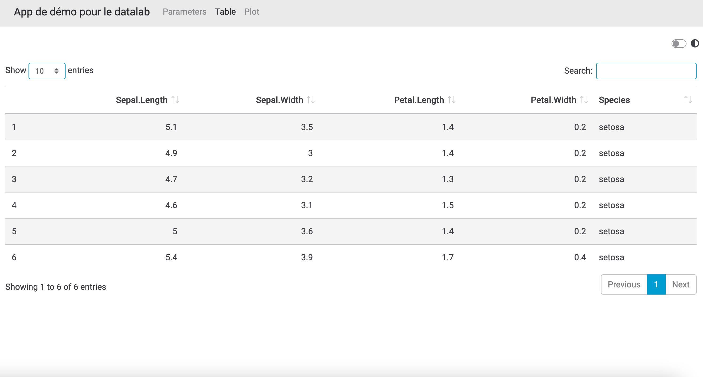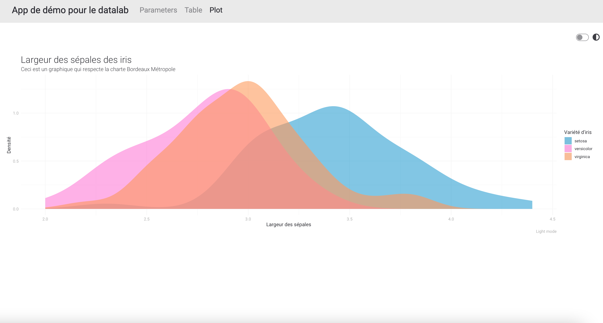

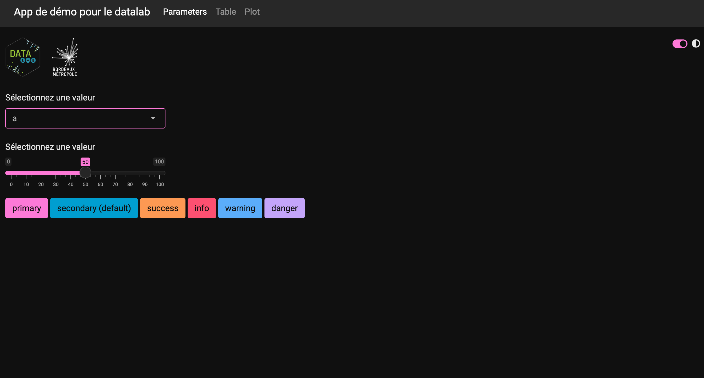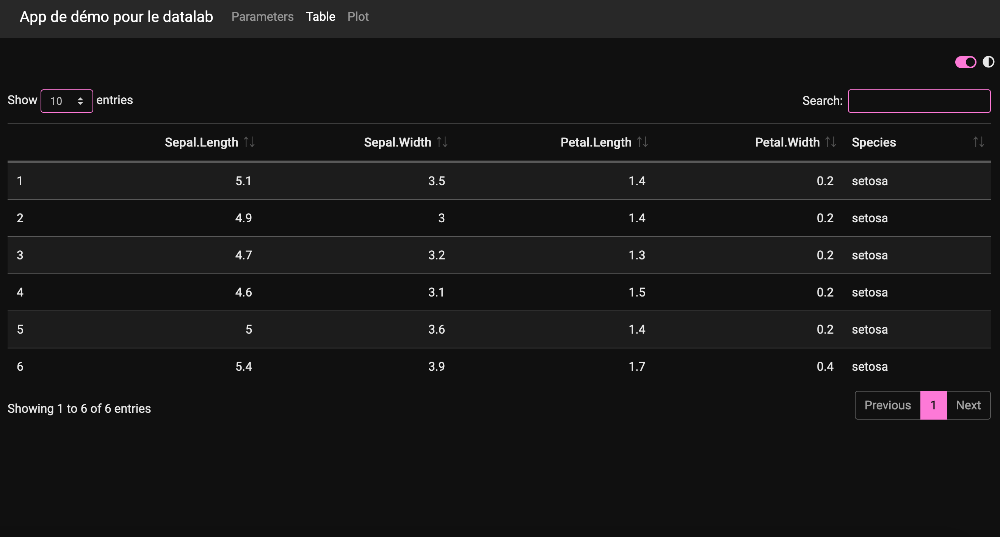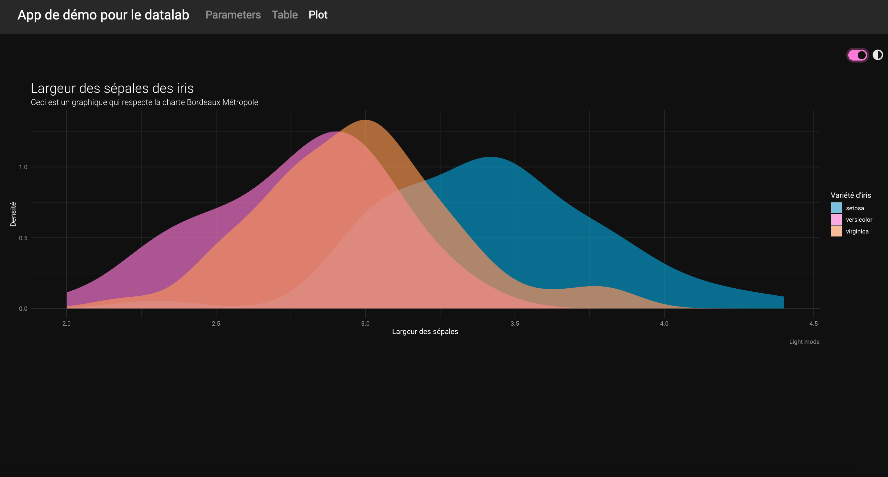

## Licence

Copyright 2021 ThinkR. All rights reserved.
