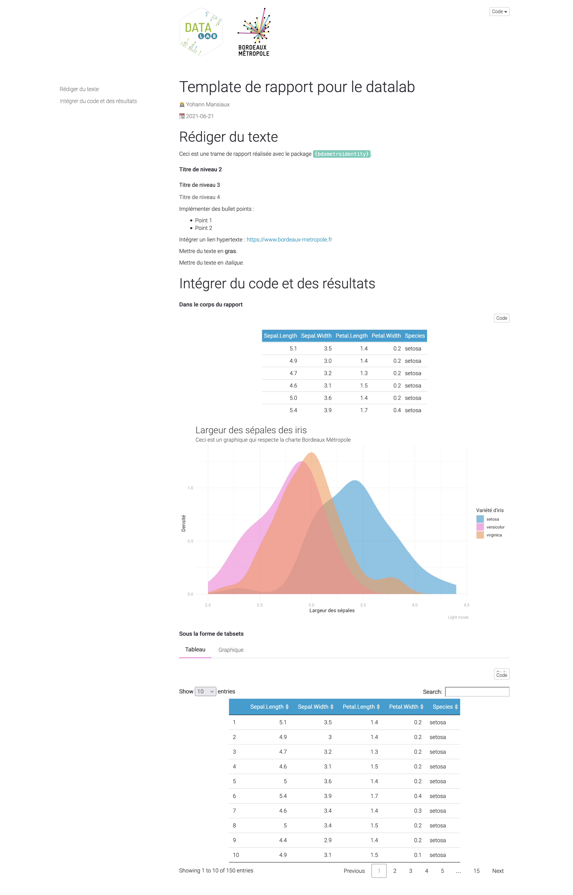
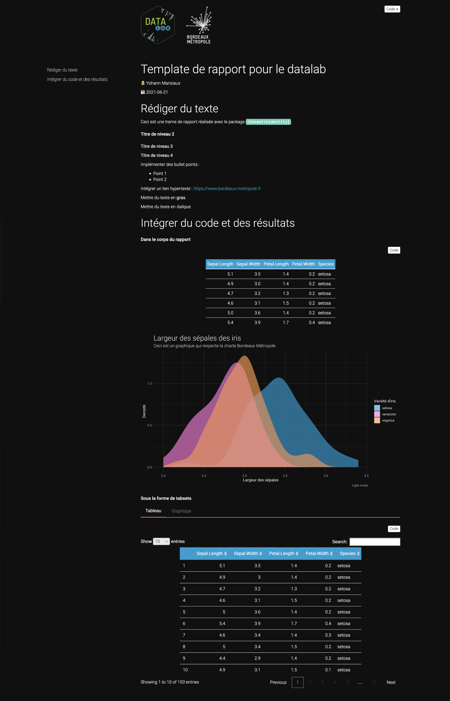

<script type="text/javascript">
$(document).ready(function () {
  window.initializeCodeFolding("show" === "hide");
});
</script>

```{r include=FALSE}
knitr::opts_chunk$set(
  echo = TRUE
)
```

```{r}
library(bdxmetroidentity)
```

# Créer un rapport HTML

La fonction `html_document_bdxmetro()` permet de convertir un fichier .Rmd au format .html. Elle admet un argument `theme` qui correspond au mode de design qui doit être utilisé pour l'output (`light` ou `dark`). Elle admet également des arguments `toc`, `toc_depth` et `toc_float`, similaires à ceux de la fonction `rmarkdown::html_document()`, pour contrôler l'aspect de la table des matières.

La fonction `html_document_bdxmetro()` est appelée dans l'argument `output_format` de la fonction `rmarkdown::render()`.

Lors de son utilisation, la fonction affiche un message à l'utilisateur. Elle lui indique comment ajouter un logo dans l'entête du rapport :

```{r echo=FALSE}
message("********************************************************************************************************")
  message("You want to integrate a logo in the header of your report?")
  message("If yes, you must modify the title section of the .Rmd report header by copying/pasting the following content:")
  message('title: |
    `){width=250px style="display: block; margin-bottom: 50px"}
    Report title')
  message("Do not forget to change 'Report title'")
  message("********************************************************************************************************")
```

Exemple d'utilisation de la fonction `html_document_bdxmetro()` avec le thème light : 

```{r eval=FALSE}
# Store in temp file for the example
rmddir <- tempfile(pattern = "rmd-")
dir.create(rmddir)

# Knit
rmarkdown::render(input = system.file("rmarkdown", "rmd_template_light.Rmd", package = "bdxmetroidentity"), 
                  output_format = html_document_bdxmetro(theme = "light"),
                  output_dir = rmddir)

# Open the knitted example
browseURL(file.path(rmddir, "rmd_template_light.html"))
```

```{r echo=FALSE, out.width=600, fig.align='center'}

```

Exemple d'utilisation de la fonction `html_document_bdxmetro()` avec le thème dark : 

```{r eval=FALSE}
# Store in temp file for the example
rmddir <- tempfile(pattern = "rmd-")
dir.create(rmddir)

# Knit
rmarkdown::render(input = system.file("rmarkdown", "rmd_template_dark.Rmd", package = "bdxmetroidentity"), 
                  output_format = html_document_bdxmetro(theme = "dark"),
                  output_dir = rmddir)

# Open the knitted example
browseURL(file.path(rmddir, "rmd_template_dark.html"))
```

```{r echo=FALSE, out.width=600, fig.align='center'}

```

Le package propose également une fonction `html_vignette_bdxmetro()` qui fonctionne selon le même principe que `rmarkdown::html_vignette()`. Elle construit une vignette HTML, alternative plus légère aux documents HTML construits avec `html_document_bdxmetro()`, qui peut être incluse dans les packages. Son utilisation est similaire à `html_document_bdxmetro()` :

```{r eval=FALSE}
# Store in temp file for the example
rmddir <- tempfile(pattern = "rmd-")
dir.create(rmddir)

# Knit
rmarkdown::render(input = system.file("rmarkdown", "rmd_template_vignette_light.Rmd", package = "bdxmetroidentity"), 
                  output_format = html_vignette_bdxmetro(theme = "light"),
                  output_dir = rmddir)

# Open the knitted example
browseURL(file.path(rmddir, "rmd_template_vignette_light.html"))
```

# Modifier le design des rapports

Le design des rapports est renseigné dans les fichiers css suivants : 

- `css/css_bdxmetro_light.css` pour le thème light, 
- `css/css_bdxmetro_dark.css` pour le thème dark.

Des variables sont définies au début des fichiers. Elles sont utilisées dans le corps des fichiers.

```{css eval=FALSE}
:root{
  --regular-font-family: "Roboto";
  --light-font-family: "Roboto Light";
  --thin-font-family: "Roboto Thin";
  --main-text-color: #292930;
  --main-text-color-rgba: 41, 41, 48;
  --secondary-text-color: #777777;
  --background-color-page: white;
  --brownish-grey: #777777;
  --charcoal-grey: #292930;
  --bright-blue: #0066ff;
  --cerulean: #039ed2;
  --seafoam-blue: #60ccb7;
  --bubblegum-pink: #fd79da;
  --warm-pink: #fd5072;
  --pastel-orange: #fd994e;
  --pastel-purple: #c4a5fd
}
```

Les balises utilisées pour modifier l'apparence des principaux éléments du rapport sont détaillées ci-dessous.

Pour les autres éléments, il est possible de connaître le sélecteur css en ouvrant le document HTML dans un navigateur. Puis clic droit > Inspecter puis Copy > Copy selector.

## Corps du rapport

| élément                                                   |balise dans le .css                                                                               |
|:----------------------------------------------------------|:-------------------------------------------------------------------------------------------------|
| corps du texte                                            | `body {}`                                                                                        |
| nom de l'auteur                                           | `.author{}`                                                                                      |
| date                                                      | `.date {}`                                                                                       |
| titre du rapport                                          | `h1 .title {}`                                                                                   |
| section de niveau 1                                       | `h1 {}`                                                                                          |
| section de niveau 2                                       | `h2 {}`                                                                                          |
| section de niveau 3                                       | `h3 {}`                                                                                          |
| section de niveau 4                                       | `h4 {}`                                                                                          |
| lien hypertexte                                           | `a {}`                                                                                           |

## Table des matières

| élément                                                   |balise dans le .css                                                                               |
|:----------------------------------------------------------|:-------------------------------------------------------------------------------------------------|
| table des matières                                        | `#TOC {}`                                                                                        |
| section dans la table des matières                        | `#TOC.tocify {}`, `#TOC li {}`                                                                   |

## Code R

| élément                                                   |balise dans le .css                                                                               |
|:----------------------------------------------------------|:-------------------------------------------------------------------------------------------------|
| code dans le texte                                        | `code {}`                                                                                        |
| rectangle de chunk                                        | `pre.r {}`                                                                                       |
| code dans un chunk - normal                               | `pre .sourceCode {}`                                                                             |
| code dans un chunk - opérateurs (ex : `%>%`, `+`, etc.)   | `pre .sourceCode .op {}`                                                                         |
| code dans un chunk - opérateurs (ex : `%>%`, `+`, etc.)   | `pre .sourceCode .kw {}`                                                                         |

## Tabsets

| élément                                                   |balise dans le .css                                                                               |
|:----------------------------------------------------------|:-------------------------------------------------------------------------------------------------|
| onglet dans un tabset                                     | `.nav-tabs > li > a {}`                                                                          |
| onglet actif dans un tabset                               | `.nav-tabs > li.active > a, .nav-tabs > li.active > a:focus, .nav-tabs > li.active > a:hover {}` |

## Tableaux

| élément                                                   |balise dans le .css                                                                               |
|:----------------------------------------------------------|:-------------------------------------------------------------------------------------------------|
| corps du texte dans un tableau                            | `table {}`                                                                                       |
| noms des colonnes dans un tableau                         | `th {}`                                                                                          |
| texte dans les cellules                                   | `table.dataTable.hover tbody tr {}`, `table.dataTable.display tbody tr {}`                       |
| message "showing 1 to X of Y entries" dans les datatables | `.dataTables_wrapper .dataTables_info {}`                                                        |
| filtre dans les datatables                                | `.dataTables_wrapper .dataTables_filter {}`                                                      |
| nombre de lignes affichées dans les datatables            | `.dataTables_wrapper .dataTables_length {}`                                                      |
| pagination dans les datatables                            | `.dataTables_wrapper .dataTables_paginate {}`                                                    |
| bouton Previous dans les datatables                       | `.dataTables_wrapper .dataTables_paginate .paginate_button.previous {}`                          |
| bouton Next dans les datatables                           | `.dataTables_wrapper .dataTables_paginate .paginate_button.next {}`                              |
| page actuelle dans les datatables                         | `.dataTables_wrapper .dataTables_paginate .paginate_button.current {}`                           |
