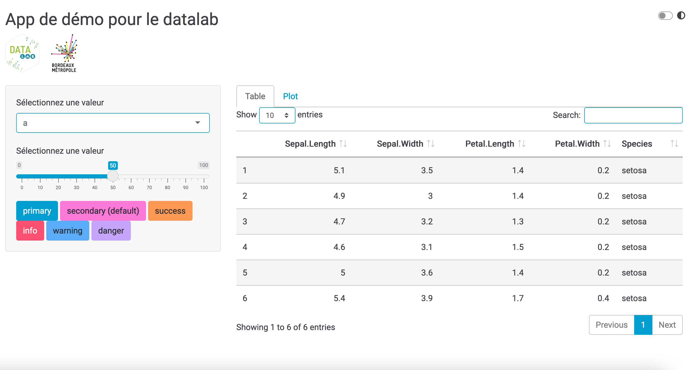

<script type="text/javascript">
$(document).ready(function () {
  window.initializeCodeFolding("show" === "hide");
});
</script>

```{r setup, include=FALSE}
knitr::opts_chunk$set(
  echo = TRUE
)
```

```{r}
library(bdxmetroidentity)
```

Le package inclut différentes fonctions dédiées à l'intégration de la charte graphique dans les apps Shiny : 

- `theme_bdxmetro_shiny()` : crée le thème bootstrap light (thème par défaut), 
- `theme_bdxmetro_dark_shiny()` : crée le thème bootstrap dark, 
- `switch_button_theme()` : insère le bouton de switch light/dark dans les UI des apps, 
- `init_cookie_theme()` : initie un cookie pour tracker le dernier thème sélectionné,
- `change_theme()` : capture le changement de thème,
- `fluidpage_bdx()` : crée une fluidPage,
- `navbarpage_bdx()` : crée une navbarPage.

# Partie UI

En fonction du design de l'app recherché, la fonction `fluidpage_bdx()` ou la fonction `navbarpage_bdx()` doit être utilisée. Ces deux fonctions miment les fonctionnalités de `shiny::fluidPage()` et de `shiny::navbarPage()`, mais incluent un thème light/dark et un bouton de switch, en haut à droite.

```{r eval=FALSE}
ui <- fluidpage_bdx(...)
ui <- navbarpage_bdx(...)
```

# Partie serveur

Les changements de thèmes sont ensuite récupérés de manière réactive dans la partie serveur. Cela passe par la création d'une reactive value (ici appelée `rv`) qui capture le thème. La fonction `init_cookie_theme()` est également appelée dans la fonction serveur au sein d'un `observeEvent`.

```{r eval=FALSE}
rv <- reactiveValues()

rv$theme <- "light"

observeEvent(session,{
  init_cookie_theme(input$dark_mode)
}, once = TRUE)

observeEvent(input$dark_mode,{

  change_theme(input$dark_mode)

  # theme to be used for the graphs
  if (isTRUE(input$dark_mode)) {
      rv$theme <- "dark"
    } else {
      rv$theme <- "light"
    }
}, ignoreInit = TRUE)
```

La reactive value qui capture le thème est utilisée pour mettre à jour les thèmes des graphiques `{ggplot2}` à chaque action sur le bouton de switch light/dark :

```{r eval=FALSE}
my_ggplot2_plot <- ggplot(data = iris) +
  aes(x = Sepal.Width, fill = Species) +
  geom_density() +
  scale_fill_bdxmetro_discrete()

output$my_plot <- renderPlot({
  
  my_ggplot2_plot +
    theme_bdxmetro(theme = rv$theme)
  
})
```

Elle peut également être utilisée pour mettre à jour le thème du logo :

```{r eval=FALSE}
output$my_logo <- renderUI({

    if (rv$theme == "light") {
      tags$img(src = "datalab-logo-lightmode.png", width = "150px")
    } else if (rv$theme == "dark") {
      tags$img(src = "datalab-logo-darkmode.png", width = "150px")
    }
  
})
```

# Apps de démo

App de démo construite autour d'un `fluidPage` :

```{r eval=FALSE}
shiny::runApp(system.file("shiny", "shiny_template_fluidpage.R", package = "bdxmetroidentity"))
```

```{r echo=FALSE, out.width=1000, fig.align='center'}

knitr::include_graphics("figures/shiny_fluid_light2.png")
```

```{r echo=FALSE, out.width=1000, fig.align='center'}
knitr::include_graphics("figures/shiny_fluid_dark1.png")
knitr::include_graphics("figures/shiny_fluid_dark2.png")
```

App de démo construite autour d'un `navbarPage` :

```{r eval=FALSE}
shiny::runApp(system.file("shiny", "shiny_template_navbarpage.R", package = "bdxmetroidentity"))
```

```{r echo=FALSE, out.width=1000, fig.align='center'}
knitr::include_graphics("figures/shiny_nav_light1.png")
knitr::include_graphics("figures/shiny_nav_light2.png")
knitr::include_graphics("figures/shiny_nav_light3.png")
```

```{r echo=FALSE, out.width=1000, fig.align='center'}
knitr::include_graphics("figures/shiny_nav_dark1.png")
knitr::include_graphics("figures/shiny_nav_dark2.png")
knitr::include_graphics("figures/shiny_nav_dark3.png")
```
